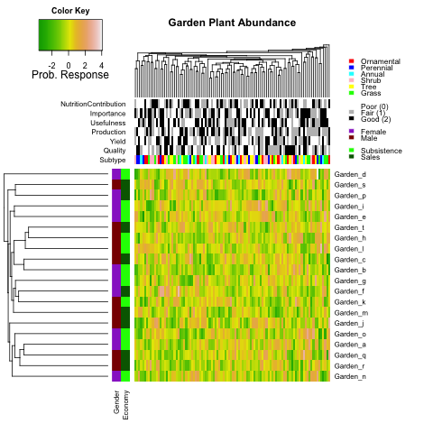

<!-- README.md is generated from README.Rmd. Please edit that file -->

# Garden heatmap 

```{r setup, include = FALSE}
knitr::opts_chunk$set(
  collapse = TRUE,
  comment = "#>",
  fig.path = "man/figures/README-",
  out.width = "100%"
)
```

This code creates a simple clustered heatmap based on [obigriffith's heatmap.function](https://raw.githubusercontent.com/obigriffith/biostar-tutorials/master/Heatmaps/heatmap.function.R)..


