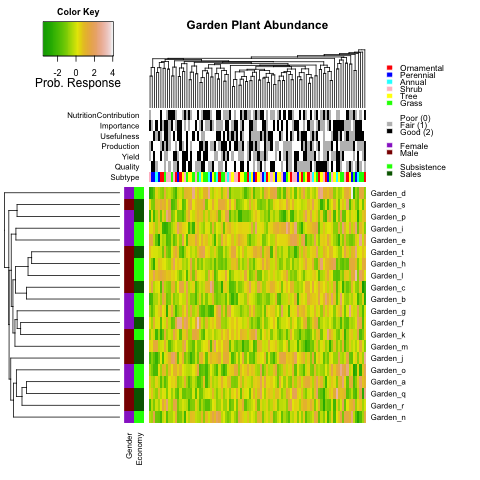

<!-- README.md is generated from README.Rmd. Please edit that file -->

# Garden heatmap

This code creates a simple clustered heatmap based on [obigriffith’s
heatmap.function](https://raw.githubusercontent.com/obigriffith/biostar-tutorials/master/Heatmaps/heatmap.function.R)..

