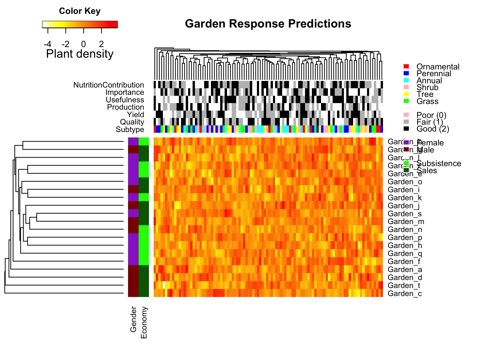

<!-- README.md is generated from README.Rmd. Please edit that file -->

This code creates a simple clustered heatmap.

## Heatmap

Create heatmap using the `heatmap.function`.

``` r

main_title = "Garden Response Predictions"

par(cex.main = 1)

heatmap.function(
  plant_abundance,
  hclustfun = myclust,
  distfun = mydist,
  na.rm = TRUE,
  scale = "none",
  dendrogram = "both",
  margins = c(6, 12),
  Rowv = TRUE,
  Colv = TRUE,
  ColSideColors = clab,
  RowSideColors = rlab,
  symbreaks = FALSE,
  key = TRUE,
  symkey = FALSE,
  density.info = "none",
  trace = "none",
  main = main_title,
  labCol = FALSE,
  labRow = Garden_names,
  cexRow = 1,
  col = rev(heat.colors(75)),
  ColSideColorsSize = 7,
  RowSideColorsSize = 2,
  KeyValueName = "Plant density"
)
legend(
  "topright",
  legend = c(
    "Ornamental",
    "Perennial",
    "Annual",
    "Shrub",
    "Tree",
    "Grass",
    "",
    "Poor (0)",
    "Fair (1)",
    "Good (2)",
    "",
    "Female",
    "Male",
    "",
    "Subsistence",
    "Sales"
  ),
  fill = c(
    "red",
    "blue",
    "cyan",
    "pink",
    "yellow",
    "green",
    "white",
    "pink",
    "grey",
    "black",
    "white",
    "darkorchid",
    "darkred",
    "white",
    "green",
    "darkgreen"
  ),
  border = FALSE,
  bty = "n",
  y.intersp = 0.7,
  cex = 0.7
)
```


